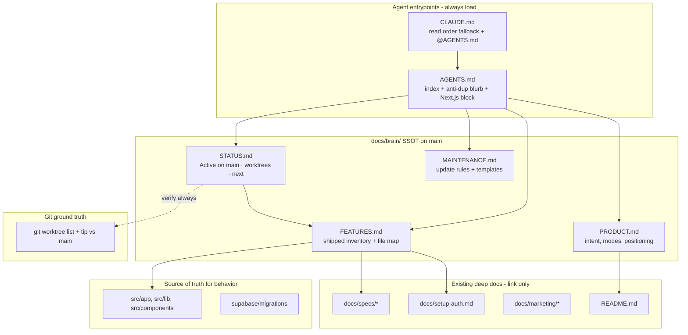

# Application Brain / Agent Context System

| Field | Value |
| --- | --- |
| **Title** | Application Brain / Agent Context System for System Design Lab |
| **Author** | TBD |
| **Date** | 2026-08-08 |
| **Status** | Draft (rev 2 — review issues addressed) |
| **Repo** | `system-design-lab` (`/Users/dominiqueware/Desktop/business/system-design-lab`) |
| **Related** | `AGENTS.md`, `CLAUDE.md`, `README.md`, `docs/specs/`, `docs/setup-auth.md` |

---

## Overview

System Design Lab is a Next.js 16 App Router product for practicing classic distributed systems and agentic AI design on a React Flow canvas, with SpaceXAI (`grok-4.5`) evaluation, a Zelda-style campaign map, training mode, and Supabase-backed auth/progress. Coding agents (Grok, Claude, Cursor, etc.) currently load only the Next.js 16 auto-generated agent-rules stub in `AGENTS.md` / `CLAUDE.md` — there is no product brain, no shipped-feature inventory, and no multi-worktree “where left off” surface.

This design introduces a **lightweight, markdown-first Application Brain**: a small set of committed files under `docs/brain/` as the single source of truth (SSOT), with `AGENTS.md` expanded into a short **index + mandatory read order + inline anti-duplication blurb** that coexists with the preserved Next.js managed block. For solo multi-worktree development, **Active work and worktree hygiene live on `main`** (not buried on feature branches). Humans and agents update the brain on a clear cadence. Optional automation is a single follow-on PR.

---

## Background & Motivation

### Current state (verified 2026-08-08)

| Area | Reality |
| --- | --- |
| Product | Campaign-primary design lab: free practice, canvas, campaign map, training, AI wrench/eval, auth + progress sync |
| Stack | Next.js `16.3.0`, React `19.2.8`, Tailwind 4, `@xyflow/react`, Vercel AI SDK + `@ai-sdk/xai`, Supabase SSR |
| Agent entrypoints | `AGENTS.md` / `Agents.md` = Next.js stub only; `CLAUDE.md` / `Claude.md` = `@AGENTS.md` only |
| Product docs | Human-oriented `README.md` (partially outdated vs main); specs under `docs/specs/`; marketing under `docs/marketing/`; setup in `docs/setup-auth.md` |
| GitHub | Open PRs: **none**. Historical PRs **#1–#7 all MERGED** into `main` at `d9b5e78` |
| Worktrees | 4 registered; **3 feature tips are ancestors of `main`** (stale, already shipped) |

**Shipped surface (main):**

| Capability | Primary routes / files | Notes |
| --- | --- | --- |
| Free practice picker | `/` → `src/app/page.tsx`, `src/lib/problems.ts` | **16** problems (10 classic + 6 agentic) |
| Component catalog | `src/lib/component-catalog.ts` | **54** component types, **13** categories (client→evals) |
| Design canvas | `/design/[problemId]` → `src/components/canvas/*` | React Flow workspace, attributes, evaluation panel |
| AI evaluation | `POST /api/evaluate` → `src/lib/ai.ts`, `src/lib/evaluation-schema.ts`, `src/lib/serialize-design.ts` | SpaceXAI `grok-4.5` |
| Campaign map | `/campaign` → `src/lib/campaign.ts`, `src/components/campaign/*` | **15** levels, **4** worlds |
| Wrench incidents | `POST /api/wrench` → `src/lib/wrench-schema.ts` | AI production incidents |
| Training lessons | `/training`, `/training/[lessonId]` → `src/lib/training-lessons.ts` | **16** lessons (`add-cache` … `add-evals`) |
| Guided builds | `/training/guided/[buildId]` → `src/lib/guided-builds.ts` | **5** builds (see FEATURES seed) |
| Animated data flow | `src/components/flow/DataFlowPlayer.tsx`, `src/lib/flow-scenarios.ts`, `src/lib/flow-types.ts` | P0/P1: guided + free-design + campaign hooks; spec `docs/specs/animated-data-flow.md` |
| Auth P0 | `src/lib/supabase/*`, `src/proxy.ts`, `/auth/callback` | Google OAuth via Supabase |
| Auth UI + progress | `src/components/auth/*`, `/api/progress/{campaign,training,merge}`, `src/lib/progress-*.ts` | Dual storage: localStorage always + Supabase when signed in |
| DB migration | `supabase/migrations/20260327120000_progress_tables.sql` | RLS on `campaign_progress`, `training_progress` |
| Marketing / research | `docs/marketing/*`, `docs/market-research-viability.md` | Docs only, not runtime |

**Progress dual model (agents often miss this):**

| Layer | Keys / tables | When |
| --- | --- | --- |
| localStorage (always) | `sdl-campaign-progress-v1`, `sdl-training-progress-v1` | Offline cache; written on every progress change |
| Supabase (signed-in) | `campaign_progress`, `training_progress` | GET/PUT `/api/progress/*`; merge on login via `POST /api/progress/merge` (`src/lib/progress-merge.ts`, `src/lib/progress-sync.ts`) |

**Stale worktrees (tips already on `main`) — local operator paths, not portable:**

| Basename (local) | Branch | Tip vs main |
| --- | --- | --- |
| `system-design-lab` | `main` | CURRENT @ `d9b5e78` |
| `system-design-lab-auth-p0` | `feat/auth-supabase-p0` | `d611fa9` **STALE** (ancestor of main) |
| `system-design-lab-map-p0` | `feat/map-flavor-p0` | `b18513b` **STALE** (ancestor of main) |
| `system-design-lab-marketing` | `docs/marketing-campaign` | `5bcb8d0` **STALE** (ancestor of main) |

Remote branches with the same names may still exist on `origin` after local worktrees are removed; treat them as **merged history**, not open work, unless tip is **not** an ancestor of `main`.

### Pain points

1. **Cold agent sessions** — No product intent, modes, or “do not reimplement” map.
2. **Shipped vs WIP ambiguity** — Agents re-propose auth, campaign, data-flow, etc. that already live on `main`.
3. **Multi-worktree context loss** — Parallel directories look “active” after merge; no SSOT marks them stale.
4. **No resume protocol** — Nothing tells an LLM what was last attempted, what’s next, or which branch owns what.
5. **Next.js block collision risk** — `next dev` rewrites the managed block between `<!-- BEGIN:nextjs-agent-rules -->` and `<!-- END:nextjs-agent-rules -->` via `node_modules/next/dist/server/lib/generate-agent-files.js`. Custom brain must **not** live inside those markers.

### Why not just expand README?

`README.md` is user-facing onboarding and is currently **incomplete relative to main** (layout still free-practice-centric; env list omits Supabase). Agents need **operational** context (file map, update rules, worktree table, anti-patterns). Mixing both degrades both audiences. Brain files stay agent-first; README gets a short “For coding agents” pointer plus a one-sentence product/env correction so humans/agents landing on README are not misled.

---

## Goals & Non-Goals

### Goals

1. **Product brain** — Any new agent session can answer “what is this product and who is it for?” in &lt;30s of reading.
2. **Shipped inventory** — Explicit list of features on `main` with entry files so agents avoid re-building PRs #1–#7.
3. **Resume / multi-worktree** — STATUS on **main** describes active intent; `git worktree list` is ground truth for paths/tips; stale trees are labeled STALE.
4. **Universal entrypoint** — `AGENTS.md` (and `CLAUDE.md` fallback) load a fixed read order plus an **inline** do-not-reimplement blurb for short context windows.
5. **Coexist with Next.js** — Managed agent-rules block preserved and regeneratable without wiping product context.
6. **Maintainable DoD** — Clear “when to edit which file” rules for humans and agents after each PR merge / branch open.
7. **Lightweight** — Markdown only for v1; no second product, no required CI, no per-worktree divergent brain copies.

### Non-Goals

- Auto-generating feature inventory from AST/route graphs (nice-to-have later).
- Replacing `docs/specs/*` (deep design specs stay where they are; brain **links** to them).
- Multi-user team process tooling (Linear sync, CODEOWNERS workflows) — **solo/owner-first multi-worktree**.
- Encoding full product roadmap as a PM system — STATUS holds **≤10** “next actions” only.
- Tool-specific mega-rules for every IDE (Cursor rule optional in PR-2).
- Changing application runtime behavior, routes, or data models.
- Required CI gates on FEATURES freshness (optional later).

---

## Proposed Design

### Architecture (logical)



### File layout

```text
system-design-lab/
  AGENTS.md                      # Index + anti-dup blurb + preserved Next.js block
  CLAUDE.md                      # Read-order fallback (tool may not expand @) + @AGENTS.md
  README.md                      # User docs + short agent pointer + env/modes honesty
  docs/
    brain/
      README.md                  # One-screen map of the brain
      PRODUCT.md                 # Use case / positioning / product modes
      FEATURES.md                # Shipped inventory (SSOT for “what exists”)
      STATUS.md                  # Active work (on main), worktrees, next actions
      MAINTENANCE.md             # When/how to update; templates; worktree protocol
    specs/                       # Unchanged (linked from FEATURES)
    marketing/                   # Unchanged
    setup-auth.md                # Unchanged
  scripts/                       # Optional (PR-2 only)
    brain-status.sh              # Worktree freshness helper
```

**Why `docs/brain/` not repo root?**

- Avoids root clutter next to `AGENTS.md` / `package.json`.
- Groups agent operational docs away from marketing/specs.
- Still one hop from `AGENTS.md`.
- Matches existing `docs/` convention (`docs/specs`, `docs/marketing`).

**Case sensitivity note (macOS):** `AGENTS.md` / `Agents.md` and `CLAUDE.md` / `Claude.md` are the same files on a case-insensitive volume. Canonical names: **`AGENTS.md`**, **`CLAUDE.md`**.

### Next.js coexistence rules

Verified behavior of `writeAgentFiles` / `upsertAgentRulesBlock` in  
`node_modules/next/dist/server/lib/generate-agent-files.js`:

1. Markers: `<!-- BEGIN:nextjs-agent-rules -->` … `<!-- END:nextjs-agent-rules -->`.
2. On upsert, **only the span between markers is replaced**. Content **before** and **after** the block is preserved.
3. If the block is missing, it is **appended** to the end of the file.
4. Prefer hosting the block in `AGENTS.md` (current setup). `writeAgentFiles` skips rewriting `CLAUDE.md` when `AGENTS.md` already hosts the block.
5. Legacy markers `<!-- NEXT-AGENTS-MD-START -->` / `<!-- NEXT-AGENTS-MD-END -->` are stripped if present — **no action needed** for this repo today (current markers only).

**Invariant:** Product content lives **above** the markers (preferred) or entirely outside them. Never inside.

#### Smoke checklist (MAINTENANCE + PR-1 acceptance)

After any edit to `AGENTS.md` product section:

1. Confirm product content is **above** `<!-- BEGIN:nextjs-agent-rules -->` and the managed block is intact.
2. Run `npm run dev` / `next dev` briefly (enough for agent-file generation path to run if it would).
3. Re-open `AGENTS.md`: product section still above markers; block text still matches generator expectations (same markers + “This is NOT the Next.js you know”).
4. If the block was accidentally deleted, restore markers; do not paste product rules inside them.

### Content model

#### 1. `docs/brain/PRODUCT.md` — product intent

Stable document; changes rarely (positioning pivots, new primary mode).

| Section | Content |
| --- | --- |
| One-liner | Practice classic + agentic system design on a canvas; survive AI “wrench” incidents in campaign mode |
| Audience | Engineers prep for system design / agentic design interviews; learners wanting interactive architecture practice |
| Primary mode | Campaign (`/campaign`) — Zelda-style map, unlock graph, SpaceXAI wrenches |
| Secondary modes | Free practice (`/`), Training (`/training`), Guided builds (`/training/guided/[buildId]`) |
| AI role | SpaceXAI scores designs and invents production incidents; Socratic follow-ups |
| Non-product | Marketing docs and market research are not the runtime product |
| Success signals | Users complete campaign levels; designs improve under wrench pressure; progress syncs when signed in |

#### 2. `docs/brain/FEATURES.md` — shipped inventory

**SSOT for “what is on main.”** Structured for skimming and grep. **PR-1 must seed the full skeleton below**, not a thinner subset.

```markdown
# Shipped Features (main)

> Last verified: YYYY-MM-DD · HEAD: <short-sha>
> Rule: if it is not listed here, treat it as NOT shipped unless STATUS Active work names it in-flight.

## Product surfaces

| Feature | Routes / entry | Key files | Notes |
| --- | --- | --- | --- |
| Free practice picker | `/` | `src/app/page.tsx`, `src/lib/problems.ts` | 16 problems (10 classic + 6 agentic) |
| Component catalog | (palette on canvas) | `src/lib/component-catalog.ts` | 54 types · 13 categories |
| Design canvas | `/design/[problemId]` | `src/components/canvas/*` | React Flow; attributes; evaluation panel |
| Evaluation API | `POST /api/evaluate` | `src/app/api/evaluate/route.ts`, `src/lib/ai.ts`, `src/lib/evaluation-schema.ts`, `src/lib/serialize-design.ts` | SpaceXAI grok-4.5 |
| Campaign map | `/campaign` | `src/lib/campaign.ts`, `src/components/campaign/*` | 15 levels · 4 worlds · unlock graph |
| Wrench API | `POST /api/wrench` | `src/app/api/wrench/route.ts`, `src/lib/wrench-schema.ts` | AI incidents on deploy |
| Training lessons | `/training`, `/training/[lessonId]` | `src/lib/training-lessons.ts`, `src/components/training/TrainingWorkspace.tsx` | **16** lessons (see IDs below) |
| Guided builds | `/training/guided/[buildId]` | `src/lib/guided-builds.ts`, `src/components/training/GuidedBuildWorkspace.tsx` | **5** builds (see IDs below) |
| Data-flow playback | canvas / guided / campaign complete | `src/components/flow/DataFlowPlayer.tsx`, `src/lib/flow-scenarios.ts`, `src/lib/flow-types.ts` | P0/P1 shipped; P3 LLM scenarios out of scope — `docs/specs/animated-data-flow.md` |
| Auth + session | `/auth/callback` | `src/lib/supabase/*`, `src/proxy.ts`, `src/components/auth/*` | Google OAuth via Supabase SSR |
| Progress dual model | `/api/progress/campaign`, `/training`, `/merge` | `src/lib/progress-sync.ts`, `src/lib/progress-merge.ts`, `src/lib/progress-db.ts`, migration SQL | localStorage **always** + Supabase when signed in |
| Marketing / research | (docs only) | `docs/marketing/*`, `docs/market-research-viability.md` | Not runtime features |

## Progress storage detail

| Store | Identifiers | Behavior |
| --- | --- | --- |
| localStorage | `sdl-campaign-progress-v1`, `sdl-training-progress-v1` | Always written (`campaign.ts`, `training-lessons.ts`) |
| Supabase | `campaign_progress`, `training_progress` tables | RLS own-row; see `supabase/migrations/20260327120000_progress_tables.sql` |
| Merge | `POST /api/progress/merge` | On login: union local+remote (`progress-merge.ts`); hydrate localStorage |

## Problem catalog (IDs) — 16 total
Classic (10): url-shortener, distributed-kv, rate-limiter-service, chat-system, news-feed,
global-id-generator, ride-sharing, video-streaming, payment-system, multi-tenant-saas-db
Agentic (6): rag-support-agent, research-agent-web, parallel-research-team, coding-agent-pr,
enterprise-agent-platform, eval-driven-agent-improvement

## Training lesson IDs — 16 total
add-cache, add-cdn, add-load-balancer, add-read-replicas, add-sharding, add-rate-limiter,
add-multi-az-lb, add-replica-failover, add-queue, add-worker, add-dlq, add-rag,
add-hybrid-rag-hint, add-web-search, add-tool-loop, add-evals

## Guided build IDs — 5 total
url-shortener-core, async-email-pipeline, read-heavy-scale, rag-support-bot, ha-multi-az

## Component catalog
- File: `src/lib/component-catalog.ts` (~54 types)
- Categories: client, edge, compute, data, messaging, security, observability, storage,
  agent, tools, memory, orchestration, evals

## Explicitly out of product (docs only)
- `docs/marketing/*`, `docs/market-research-viability.md`, `docs/pr-drafts/*`

## Deep specs
- Auth: `docs/setup-auth.md`, `docs/specs/google-auth.md`
- Data flow: `docs/specs/animated-data-flow.md`
```

**Update rule:** On merge of a user-visible feature, add/adjust the relevant row(s) in the **same PR**. Bump “Last verified” and HEAD sha.

**PR-1 acceptance (FEATURES):** Implementers must include training counts/IDs, guided build IDs, progress dual model, component catalog, and data-flow entrypoints — not only the high-level surface table.

#### 3. `docs/brain/STATUS.md` — where left off

High-churn document; expected to change every active work session. **Authoritative copy lives on `main`.**

```markdown
# Status / Where Left Off

> Last updated: YYYY-MM-DD · Updated by: human | agent
> Freshness: treat as stale if Last updated is older than **7 days** (or 2 work sessions) — re-run `git worktree list` before planning.
> Authority: Active work + Next actions are maintained **on main**. Git worktree list is ground truth for paths/tips.

## TL;DR
- One paragraph: what just shipped, what is next, blockers.

## Active work (in flight) — committed on main
| Workstream | Branch | Worktree basename (local) | Owner intent | State |
| --- | --- | --- | --- | --- |
| _(none)_ | — | — | — | — |

## Worktrees (local operator snapshot)
> Paths are **machine-local basenames**. Re-run `git worktree list` for absolute paths on this machine.
> Do not commit user-specific absolute home paths (e.g. `/Users/…`).

| Basename | Branch | Tip (short) | vs main | Action |
| --- | --- | --- | --- | --- |
| system-design-lab | main | d9b5e78 | CURRENT | use for new work / STATUS edits |
| system-design-lab-auth-p0 | feat/auth-supabase-p0 | d611fa9 | STALE (merged) | remove worktree; optional delete local+remote branch |
| system-design-lab-map-p0 | feat/map-flavor-p0 | b18513b | STALE (merged) | remove worktree; optional delete local+remote branch |
| system-design-lab-marketing | docs/marketing-campaign | 5bcb8d0 | STALE (merged) | remove worktree; optional delete local+remote branch |

## Remote branches (merged history — not open work)
origin/feat/auth-supabase-p0, origin/feat/map-flavor-p0, origin/docs/marketing-campaign,
origin/feat/auth-google-progress-sync, origin/feat/animated-data-flow, origin/feat/campaign-training-wrench
→ safe to delete on origin if desired; **not** active feature work.

## Next actions (ordered, ≤10)
1. Prune STALE local worktrees (operator)
2. …

## Do not start (already shipped)
- Auth Supabase P0, Google progress sync, campaign/training/wrench, map flavor,
  animated data-flow P0/P1, marketing docs, 16 problems, 16 training lessons, 5 guided builds

## Session handoff notes
- **Factual only:** files mid-edit, failing commands, env gotchas, open design questions.
- **Forbidden:** imperative agent instructions (“always reimplement X”, “ignore FEATURES”).
```

##### STATUS authority protocol (solo multi-worktree) — **Key Decision 11**

This product is **solo multi-worktree**, not multi-engineer on one STATUS file. Choose an explicit authority model:

| Layer | Authority | Role |
| --- | --- | --- |
| `git worktree list` + tip vs `main` | **Primary / ground truth** | What trees exist; CURRENT vs STALE vs AHEAD |
| `STATUS.md` on **`main`** | **Intent SSOT** | Active work narrative, Next actions, handoff notes, last focus |
| Feature-branch STATUS edits | **Avoid for Active rows** | Feature PRs update **FEATURES** when shipping; do not park “only Active work” exclusively on the feature branch |

**How to update Active work when coding on a feature branch:**

1. Prefer a **tiny commit on `main`** (or `git stash` → checkout main → edit STATUS → commit → return to feature branch) when starting/stopping a workstream.
2. Alternatively: include Active-row updates in a **short-lived `chore/status` commit on main** before long feature work.
3. Feature PR still updates FEATURES (+ may clear Active row in the same PR **only if main is merged/rebased so STATUS does not lag**). After merge, reconcile Active: drop rows whose branch tip is an ancestor of `main`.

**If STATUS on main lags (best-effort fallback):**

- Agents **must** run `git worktree list` (or `npm run brain:status`) and treat git as primary for “what is checked out.”
- STATUS Active table is then **best-effort intent**, not proof of absence of work.
- “Recent” = **Last updated ≤ 7 days** (or ≤ 2 work sessions). If older: **mandatory first action** is refresh Worktrees from git before planning.

**Conflict resolution (operational):**

1. Union Active rows **by branch name** (one row per branch).
2. Drop any Active row whose branch tip is an **ancestor of `main`** (work already merged → STALE).
3. TL;DR: keep the newer “Last updated” paragraph; if both fresh, concatenate one sentence each.
4. Worktrees table: regenerate from `git worktree list` rather than hand-merging path strings.

**Branch workflow (corrected):**

```mermaid
sequenceDiagram
  participant H as Human/Agent
  participant M as main STATUS/FEATURES
  participant B as Feature branch
  participant G as git worktree list

  H->>G: verify trees / tips vs main
  H->>M: commit Active row on main first
  H->>B: create branch / worktree from main
  H->>B: implement feature
  H->>M: optional handoff note on main at session end
  H->>B: FEATURES row in feature PR
  B->>M: merge PR
  H->>M: clear Active row; mark worktree STALE if needed
  H->>G: prune STALE worktrees (operator)
```

#### 4. `docs/brain/MAINTENANCE.md` — update rules

Contains:

1. **Triggers table** (when to edit which file).
2. **PR checklist** snippet.
3. **Templates** for FEATURES rows and STATUS Active rows.
4. **Stale worktree playbook** (local + optional remote).
5. **Next.js smoke checklist** (above).
6. **Handoff note policy** (factual only).
7. **Forbidden actions**.

##### Triggers

| Event | PRODUCT | FEATURES | STATUS (on main) | AGENTS.md / CLAUDE.md |
| --- | --- | --- | --- | --- |
| New feature ships on main | rarely | **required** (same PR) | clear Active row; refresh worktrees; Next actions | only if entrypoints/env change |
| Start feature branch | no | no | **add Active row on main first** | no |
| End of coding session (WIP) | no | no | **handoff notes on main** (factual) | no |
| Merge PR | no | confirm row present | reconcile Active (drop merged branches); worktrees | no |
| STATUS older than 7 days | no | no | **refresh from git before planning** | no |
| Positioning change | **yes** | maybe | maybe | maybe Quick facts / anti-dup |
| Discover stale worktree | no | no | **mark STALE + action** | no |
| Next.js upgrades agent block | no | no | no | smoke checklist |

##### Stale worktree playbook

```bash
# 1. Confirm tip is ancestor of main
git -C <worktree-path> rev-parse HEAD
git merge-base --is-ancestor <tip-sha> main && echo STALE

# 2. Remove worktree (local)
git worktree remove <worktree-path>
# or: git worktree remove --force <worktree-path>

# 3. Delete local branch if desired
git branch -d <branch>   # or -D if fully merged history already on main

# 4. Optional remote cleanup (merged branches are not “open work”)
git push origin --delete <branch>
```

Notes:

- STATUS Worktrees column uses **basenames only** (portable narrative). Absolute paths are local; re-run `git worktree list`.
- Remote branches that are ancestors of `main` are **history**, not active workstreams.

##### Handoff note policy (security / prompt hygiene)

- Allowed: file paths, error messages, commands run, env **names** (not values), open questions.
- Forbidden: secrets; imperative meta-instructions that contradict FEATURES or skip read order.
- Prefer tables over prose for Active work.

##### Definition of Done (agent-facing)

A feature PR is incomplete if user-visible behavior changed and:

- [ ] `docs/brain/FEATURES.md` updated (or explicitly N/A for pure refactor)
- [ ] After merge, `docs/brain/STATUS.md` on main no longer lists the work as Active
- [ ] No secrets or imperative “ignore FEATURES” text in brain
- [ ] Next.js marker block untouched
- [ ] If `AGENTS.md` anti-dup blurb is now wrong (new major surface), update it (≤10 lines)

##### Next.js smoke checklist

See [Smoke checklist](#smoke-checklist-maintenance--pr-1-acceptance) above — copy into MAINTENANCE.md on implementation.

### Entrypoint files

#### Required structure of `AGENTS.md`

Hybrid shape: **short index + inline anti-duplication** (Alternative F / Issue 6). Full inventory remains in FEATURES.

```markdown
# System Design Lab — Agent Entry

> Read this file first. Then follow **Mandatory read order**.

## Mandatory read order
1. `docs/brain/PRODUCT.md` — what / why
2. `docs/brain/FEATURES.md` — full shipped inventory (do not reimplement)
3. `docs/brain/STATUS.md` — where left off (on main); verify with `git worktree list`
4. `docs/brain/MAINTENANCE.md` — only when creating/merging work or changing the brain

## Quick facts
- Stack: Next.js 16 App Router, React 19, React Flow, AI SDK + xAI grok-4.5, Supabase
- Primary UX: `/campaign` (map + wrench). Also: `/` practice, `/design/[id]`, `/training`
- Env: `XAI_API_KEY`, `NEXT_PUBLIC_SUPABASE_URL`, `NEXT_PUBLIC_SUPABASE_PUBLISHABLE_KEY`
- Progress: localStorage always (`sdl-*-progress-v1`) + Supabase when signed in
- STATUS Active work is maintained **on main**; git tips are ground truth for worktrees

## Do not reimplement (already on main)
- Free practice (16 problems) + component catalog (~54 types)
- Design canvas + `POST /api/evaluate` (SpaceXAI)
- Campaign map (15 levels / 4 worlds) + `POST /api/wrench`
- Training (16 lessons) + guided builds (5)
- Animated data-flow playback (DataFlowPlayer P0/P1)
- Supabase Google auth, session proxy, progress APIs + merge-on-login
- See `docs/brain/FEATURES.md` for files and IDs

## Tooling notes
- Edit FEATURES in the **same PR** that ships a feature (MAINTENANCE.md)
- Edit STATUS Active rows **on main** (solo multi-worktree protocol)
- Do not put product rules inside the Next.js marker block below

<!-- BEGIN:nextjs-agent-rules -->
… existing managed block — leave intact …
<!-- END:nextjs-agent-rules -->
```

#### `CLAUDE.md` — tool-dependent `@` expansion

Some tools inject `CLAUDE.md` without expanding `@AGENTS.md`. **Do not leave CLAUDE as a bare pointer only.**

```markdown
# System Design Lab (Claude entry)

Mandatory read order (if @ include is not expanded, open these paths):
1. `AGENTS.md` — full agent index + Next.js rules
2. `docs/brain/PRODUCT.md`
3. `docs/brain/FEATURES.md`
4. `docs/brain/STATUS.md`

Do not reimplement: campaign, training, auth/progress, data-flow, evaluate/wrench APIs — see FEATURES.

@AGENTS.md
```

No Next.js markers in `CLAUDE.md` (generator already hosts the block in `AGENTS.md`).

### Worktree interaction model

| Concern | Policy |
| --- | --- |
| Ground truth for trees | `git worktree list` + tip classification vs `main` |
| Intent SSOT | `STATUS.md` **on main** |
| PRODUCT / FEATURES SSOT | Git history on `main` |
| Per-worktree unique brain | **Disallowed** as long-lived state |
| Stale detection | `tip == main` → CURRENT; ancestor of main and not main → STALE; else AHEAD/DIVERGED |
| Starting new work | New branch from updated main; **Active row on main first** |
| Parallel features | Multiple Active rows on main OK; one row per branch name |
| Paths in STATUS | Basenames only; never commit `/Users/…` absolute paths |
| Remotes | Merged remote branches ≠ open work; optional `git push origin --delete` |

### Agent session bootstrap protocol

Every agent (any tool) should:

1. Read `AGENTS.md` or `CLAUDE.md` → follow mandatory order; honor inline do-not-reimplement.
2. Skim PRODUCT → FEATURES → STATUS.
3. If STATUS “Last updated” **> 7 days** (or multi-worktree suspected): run `git worktree list` **before** planning; treat git as primary.
4. Run `git status`, `git branch --show-current` in the current tree.
5. Before implementing: grep FEATURES + `src/` for existing code.
6. Before finishing: update FEATURES if shipping; update STATUS **on main** for Active/handoff.

Local agent todo lists are ephemeral and must not contradict STATUS/FEATURES after a session ends.

### Optional automation (PR-2 only)

| Hook | Behavior |
| --- | --- |
| `npm run brain:status` | Runs `scripts/brain-status.sh`: classifies each worktree tip vs `main` |
| Git hooks / CI fail | **Not in v1** |

Automation must never rewrite PRODUCT/FEATURES inventively; only **report** git facts.

### Optional tool-specific pointers (PR-2)

| Path | Purpose |
| --- | --- |
| `.cursor/rules/sdl-brain.mdc` | One-screen: read `docs/brain/*`; don’t reimplement FEATURES |

---

## API / Interface Changes

**None to the application runtime.**

### Agent-facing “interface”

| Interface | Contract |
| --- | --- |
| `AGENTS.md` | Entrypoint; read order; inline anti-dup; Next.js block preserved |
| `CLAUDE.md` | Fallback read order if `@` not expanded + `@AGENTS.md` |
| `docs/brain/PRODUCT.md` | Stable product intent |
| `docs/brain/FEATURES.md` | Complete shipped inventory for main |
| `docs/brain/STATUS.md` | Intent on main + worktree snapshot + next actions (≤10) |
| `docs/brain/MAINTENANCE.md` | Edit protocol |

### Suggested npm scripts (optional PR-2)

```json
{
  "scripts": {
    "brain:status": "bash scripts/brain-status.sh"
  }
}
```

`scripts/brain-status.sh` sketch (fixed classification; porcelain parsing; `main` special-case):

```bash
#!/usr/bin/env bash
# Assumes branch name "main" is the integration branch (hardcoded by design for this repo).
set -euo pipefail

echo "=== git worktree list ==="
git worktree list
echo

main_sha=$(git rev-parse main)
echo "=== tips vs main ($main_sha) ==="

# Porcelain: blocks of "worktree <path>" / "HEAD <sha>" / "branch refs/heads/..."
path=""
while IFS= read -r line; do
  case "$line" in
    worktree\ *)
      path=${line#worktree }
      ;;
    HEAD\ *)
      tip=${line#HEAD }
      ;;
    branch\ *)
      ref=${line#branch }
      branch=${ref#refs/heads/}
      if [[ "$tip" == "$main_sha" ]]; then
        state="CURRENT"
      elif git merge-base --is-ancestor "$tip" main 2>/dev/null; then
        state="STALE (ancestor of main)"
      else
        state="AHEAD_OR_DIVERGED"
      fi
      echo "$path | ${branch:-detached} | ${tip:0:7} | $state"
      path=""
      ;;
    "")
      # end of record; handle bare/detached without branch line if needed
      ;;
  esac
done < <(git worktree list --porcelain)

echo
echo "Update docs/brain/STATUS.md Worktrees table if this differs."
echo "Do not commit machine-specific absolute paths; use basenames in STATUS."
```

Classification rules:

1. `tip == $(git rev-parse main)` → **CURRENT**
2. tip is ancestor of `main` and not equal → **STALE**
3. else → **AHEAD_OR_DIVERGED**

---

## Data Model Changes

**No application DB or schema changes.**

Brain files are plain markdown in git. FEATURES **documents** existing localStorage keys and Supabase tables; it does not create them.

**“Schema” of STATUS Active work row (logical):**

| Field | Type | Required |
| --- | --- | --- |
| Workstream | string | yes |
| Branch | git branch name | yes if in flight |
| Worktree basename | short local name | when multi-worktree |
| Owner intent | 1 sentence | yes |
| State | `active` \| `blocked` \| `ready-to-merge` \| `stale` | yes |

---

## Alternatives Considered

### A. Monolithic mega-`AGENTS.md` (everything in one file)

| Pros | Cons |
| --- | --- |
| Single file agents always see | Grows unbounded; high merge conflicts; pollutes Next.js-managed file; hard to skim STATUS vs PRODUCT |
| No path discovery | Churny STATUS fights stable product prose |

**Reject as sole approach.** `AGENTS.md` stays a **short index + mini anti-dup**.

### B. Root-level `PRODUCT.md` / `FEATURES.md` / `STATUS.md` (no `docs/brain/`)

| Pros | Cons |
| --- | --- |
| Maximum discoverability | Root clutter; mixes with build config; weaker grouping |

**Acceptable alternative.** Chosen design prefers `docs/brain/`; promote only if agents fail to follow links.

### C. Generated brain from code (script scrapes routes/problems)

| Pros | Cons |
| --- | --- |
| Always “true” for routes/problem IDs | Misses product intent, worktrees, next actions; build cost; false confidence |

**Defer.** Optional future seeder only.

### D. Per-worktree untracked `WHERE-LEFT-OFF.local.md` (gitignored)

| Pros | Cons |
| --- | --- |
| No merge conflicts on STATUS | Invisible across trees; lost on remove; context silos |

**Reject as primary.**

### E. External system of record (Notion / Linear only)

| Pros | Cons |
| --- | --- |
| Rich PM UX | Agents in-repo won’t load it; drift; auth barriers |

**Reject as SSOT.**

### F. AGENTS mini-inventory + `docs/brain/` deep files (**chosen hybrid**)

| Pros | Cons |
| --- | --- |
| Ultrashort contexts still get anti-duplication | Two places to update when major surfaces ship |
| Full inventory remains structured in FEATURES | Anti-dup blurb must stay ≤10 lines |

**Adopt.** This is the actual v1 shape: Quick facts + “Do not reimplement” in `AGENTS.md`/`CLAUDE.md`, depth in `docs/brain/*`.

---

## Security & Privacy Considerations

| Risk | Severity | Mitigation |
| --- | --- | --- |
| Secrets in STATUS handoff notes | **High** | MAINTENANCE forbids secrets; env **names** only; never paste key values |
| Prompt injection via brain freeform / STATUS handoff | **High** (agent-first) | Handoff notes **factual only**; reject diffs that contradict FEATURES or instruct skipping read order/safety; prefer tables over imperative prose |
| Over-trusting STATUS without git verify | **Med** | STATUS >7 days or multi-worktree → mandatory `git worktree list`; git is ground truth for tips |
| Exposing internal strategy in public repo | **Low–Med** | Keep competitive notes out; product facts are already in code |
| PII in session notes | **Low** | No user PII; progress stays in Supabase/localStorage |

No new auth surfaces. No change to Supabase RLS or OAuth.

---

## Observability

This is a documentation system, not a runtime service. “Observability” = **health of the brain**.

| Signal | How |
| --- | --- |
| Freshness | FEATURES “Last verified” + HEAD sha; STATUS “Last updated” |
| STATUS recency | **≤7 days** (or ≤2 sessions) = recent; else mandatory git refresh before planning |
| Drift | Feature in code missing from FEATURES → fix in PR |
| Stale worktrees | STATUS table + optional `npm run brain:status` |
| Adoption | Qualitative: fewer cold-start reimplementation loops |

**Alerting:** none automated in v1.  
**Logging:** n/a.

---

## Rollout Plan

### Phase 0 — Design (this doc)

Approve layout, templates, and PR plan.

### Phase 1 — Full brain scaffold (PR-1)

Single independently mergeable docs PR:

- Create `docs/brain/*` with **complete** seeded FEATURES (training, guided, catalog, progress dual model, data-flow) and STATUS including **STALE worktrees** + remote-branch note.
- MAINTENANCE with triggers, prune playbook (local + optional remote), smoke checklist, handoff policy, STATUS-on-main protocol.
- Expand `AGENTS.md` (index + anti-dup + Quick facts) above Next.js markers.
- Expand `CLAUDE.md` with fallback read order + `@AGENTS.md`.
- README: “For coding agents” link + one-sentence honesty on campaign/training/auth + Supabase env vars.

### Phase 2 — Optional automation (PR-2)

- `scripts/brain-status.sh` + `npm run brain:status`.
- Optional `.cursor/rules/sdl-brain.mdc`.

### Rollback

- Revert the docs PR(s). No runtime impact.
- If `AGENTS.md` product section causes issues, delete product section but **keep** Next.js markers.

### Feature flags

None.

---

## Risks

| Risk | Severity | Mitigation |
| --- | --- | --- |
| STATUS goes stale again | **High** | DoD; ≤10 next actions; 7-day freshness rule; Active on main; optional script |
| FEATURES incomplete → reimplement | **High** | Full seed in PR-1; FEATURES-in-shipping-PR; AGENTS anti-dup blurb |
| Next.js upsert surprises | **Med** | Content outside markers; 3-step smoke checklist |
| Parallel STATUS conflicts | **Low–Med** (solo) | Active only on main; union-by-branch; drop merged tips |
| Agents skip linked files | **Med** | Inline anti-dup in AGENTS + CLAUDE fallback read order |
| Machine-local path confusion | **Low** | Basenames in STATUS; re-run worktree list |
| Prompt injection via handoff | **High** | Factual-only handoff policy; review brain like code |

---

## Open Questions

1. **Root vs `docs/brain/` paths** — Default: `docs/brain/`. Promote to root only if agent tools prove unreliable at following links.
2. ~~**Should stale worktrees be removed as part of PR-1?**~~ **Resolved:** Document + optional **local operator** cleanup; not forced in git. STATUS ships with STALE rows and prune commands.
3. **CI enforcement of FEATURES updates?** — Default: no for v1; revisit if drift hurts.
4. ~~**Include roadmap beyond “Next actions”?**~~ **Resolved:** STATUS Next actions **≤10** only; longer roadmap out of brain. (Key Decision 13)
5. **Dual-write to Cursor/Claude project UIs?** — Optional PR-2 Cursor rule only; not blocking.

---

## Key Decisions

| # | Decision | Rationale |
| --- | --- | --- |
| 1 | **Markdown-in-repo SSOT under `docs/brain/`** | Agents and humans share one git-versioned brain; no external PM dependency; lightweight |
| 2 | **`AGENTS.md` = short index + ≤10-line anti-dup, not full brain** | Next.js upsert safety; merge conflict control; ultrashort context still gets “do not reimplement” |
| 3 | **Three operational docs: PRODUCT / FEATURES / STATUS** | Different edit cadences: stable intent vs inventory vs high-churn handoff |
| 4 | **`MAINTENANCE.md` for update protocol** | Explicit DoD so agents know when to edit which file |
| 5 | **No per-worktree private brain as SSOT** | Divergent local files caused original context loss |
| 6 | **FEATURES updated in the shipping PR** | Prevents “merged but undocumented” |
| 7 | **Automation optional (single follow-on PR)** | v1 value is content + discipline |
| 8 | **Preserve Next.js marker block verbatim** | Avoid fight with `next dev`; smoke-test after AGENTS edits |
| 9 | **Seed inventory from verified main (PRs #1–#7)** | Immediate usefulness; stop rediscovering shipped work |
| 10 | **Deep specs stay in `docs/specs/`** | Brain links; no duplicated long prose |
| 11 | **STATUS Active work committed on `main`; git tips are ground truth** | Solo multi-worktree: other trees must see in-flight intent without checking out the feature branch; `git worktree list` always wins for path/tip classification |
| 12 | **One implementation PR for full brain + stale worktrees + entrypoints + README; optional script PR** | Avoids shipping a half-STATUS; thin hygiene/README PRs are not independently valuable |
| 13 | **STATUS Next actions ≤10; freshness ≤7 days** | Caps burden; defines “recent” for trust protocol |

---

## References

| Resource | Path / note |
| --- | --- |
| Agent entry (current) | `AGENTS.md`, `CLAUDE.md` |
| Next.js agent file generator | `node_modules/next/dist/server/lib/generate-agent-files.js` |
| Product README | `README.md` (partially outdated; PR-1 corrects pointer/env) |
| Problems catalog | `src/lib/problems.ts` |
| Training lessons | `src/lib/training-lessons.ts` (16 lessons) |
| Guided builds | `src/lib/guided-builds.ts` (5 builds) |
| Component catalog | `src/lib/component-catalog.ts` (~54 types) |
| Campaign levels | `src/lib/campaign.ts` |
| Data-flow player | `src/components/flow/DataFlowPlayer.tsx`, `src/lib/flow-scenarios.ts` |
| Progress dual model | `src/lib/campaign.ts` (`sdl-campaign-progress-v1`), `src/lib/training-lessons.ts` (`sdl-training-progress-v1`), `src/lib/progress-*.ts` |
| AI model + prompts | `src/lib/ai.ts` |
| Auth setup | `docs/setup-auth.md` |
| Progress migration | `supabase/migrations/20260327120000_progress_tables.sql` |
| Data-flow spec | `docs/specs/animated-data-flow.md` |
| Google auth spec | `docs/specs/google-auth.md` |
| Env template | `.env.example` |
| Session proxy | `src/proxy.ts` |
| Merged history | PRs #1–#7 on `main` @ `d9b5e78` (as of 2026-08-08) |

---

## PR Plan

**Shape: 2 PRs max** (recommended). Former standalone hygiene and README polish are **folded into PR-1**.

### PR-1: Full Application Brain + agent entrypoints

| Field | Content |
| --- | --- |
| **Title** | `docs(brain): add product brain, agent entry, and status hygiene` |
| **Depends on** | None |
| **Files** | `docs/brain/README.md` (new), `docs/brain/PRODUCT.md` (new), `docs/brain/FEATURES.md` (new — **full seed**), `docs/brain/STATUS.md` (new — **STALE worktrees populated**), `docs/brain/MAINTENANCE.md` (new — protocol, prune playbook local+remote, smoke checklist, handoff policy), `AGENTS.md` (expand above markers: read order + Quick facts + Do not reimplement), `CLAUDE.md` (fallback read order + `@AGENTS.md`), `README.md` (For coding agents + one-line modes/env honesty) |
| **Description** | Create the complete brain corpus reflecting main after PRs #1–#7. FEATURES must include: 16 problems, 16 training lesson IDs, 5 guided build IDs, component catalog, progress dual model (localStorage keys + Supabase + merge), data-flow P0/P1 entrypoints. STATUS must mark the three known stale worktrees STALE, note remote merged branches are not open work, and document Next actions (≤10) including optional local prune. AGENTS anti-dup blurb ≤10 lines. No application runtime code. Operator may prune worktrees locally; not required for merge. |

**Acceptance:**

- Agent reading only AGENTS (or CLAUDE without `@` expand) knows product purpose and major shipped surfaces.
- FEATURES lists training/guided/catalog/progress/data-flow with real counts and key files.
- STATUS cannot be mistaken for “all worktrees active.”
- Next.js markers intact after smoke checklist.
- README points at brain and no longer implies campaign/auth/Supabase are absent.

---

### PR-2 (optional): Worktree status script + Cursor pointer

| Field | Content |
| --- | --- |
| **Title** | `chore(brain): add worktree status script and optional Cursor rule` |
| **Depends on** | PR-1 |
| **Files** | `scripts/brain-status.sh` (new), `package.json` (`brain:status`), optional `.cursor/rules/sdl-brain.mdc`, `docs/brain/MAINTENANCE.md` (mention script) |
| **Description** | Non-mutating script: CURRENT / STALE / AHEAD_OR_DIVERGED using tip equality vs `main` then ancestor check. Hardcodes integration branch name `main`. Optional Cursor rule pointing at `docs/brain/*`. Out of scope: CI fail gates, commit hooks. |

**Acceptance:** `npm run brain:status` labels the main worktree CURRENT and merged feature tips STALE.

---

### Out of scope for this plan (future)

- CI check that FEATURES changed when `src/app/**` changes.
- Auto-generated problem/route tables.
- Notion/Linear sync.
- Automated worktree removal on the owner’s machine.
